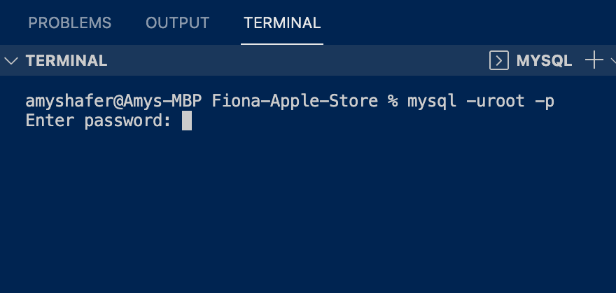

# Fiona Apple Store

Have you ever wished you had hand soap inspired by a songstress? Or maybe a moody-looking notebook to scribble some angst in? Get excited because this shop is something of an Extraordinary Machine!

## Table of contents
* [Technologies](#technologies)
* [Mockup](#mockup)
* [Resources-used](#resources-used)
* [Future-improvements](#future-improvements)
* [Walk-through-video](#walk-through-video)
* [Github-url](#github-url)
* [Learn-more](#learn-more)
* [License](#license)
* 
* 

## Technologies

Fiona Apple Store was created using Node.js, MySQL2, Sequelize, dotenv, JavaScript, and Insomnia.

## Mockup

Get MySQL going!

Run the schema file.

Next, run the seeds!

Start the application: 

Have fun!
 MySQL2

## Resources Used

More insight into design web services using the REST paradigm:

I found a trove of code snippets using sequelize here:

This article helped me understand dotenv more clearly.

## Future Improvements

In the future, I would like to add descriptions to the seeded products.

I think that this would be a fun store to design so I would enjoy revisiting that side of this project too.

## Walk Through Video
Here's a walk through video for the Fiona Apple Store:
[Fiona Apple Store Walk Through Video](link here)

## Github url
You can find the Fiona Apple Store Repository here:
[Fiona Apple Store Repository](link here)

## Learn More

In 2019, Fiona Apple pledged two years of royalties from her song "Criminal" to the organization "While They Wait". The group seeks to raise awareness and change laws to end mass incarceration and assist families going through the immigration process.  

The portraits listed in the "Art" category of this store are featured in the "Stories" section in the website below.

* [While They Wait](https://whiletheywait.org/)

## MIT License
Copyright 2022 Amy Shafer

Permission is hereby granted, free of charge, to any person obtaining a copy of this software and associated documentation files (the "Software"), to deal in the Software without restriction, including without limitation the rights to use, copy, modify, merge, publish, distribute, sublicense, and/or sell copies of the Software, and to permit persons to whom the Software is furnished to do so, subject to the following conditions:

The above copyright notice and this permission notice shall be included in all copies or substantial portions of the Software.

THE SOFTWARE IS PROVIDED "AS IS", WITHOUT WARRANTY OF ANY KIND, EXPRESS OR IMPLIED, INCLUDING BUT NOT LIMITED TO THE WARRANTIES OF MERCHANTABILITY, FITNESS FOR A PARTICULAR PURPOSE AND NONINFRINGEMENT. IN NO EVENT SHALL THE AUTHORS OR COPYRIGHT HOLDERS BE LIABLE FOR ANY CLAIM, DAMAGES OR OTHER LIABILITY, WHETHER IN AN ACTION OF CONTRACT, TORT OR OTHERWISE, ARISING FROM, OUT OF OR IN CONNECTION WITH THE SOFTWARE OR THE USE OR OTHER DEALINGS IN THE SOFTWARE.

